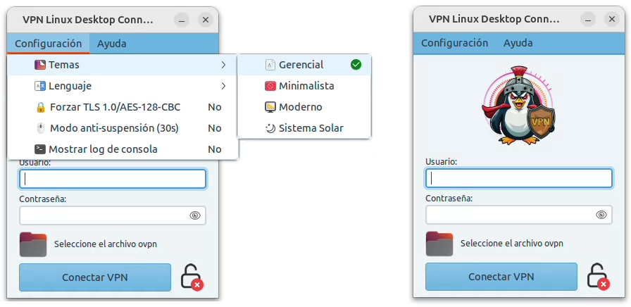
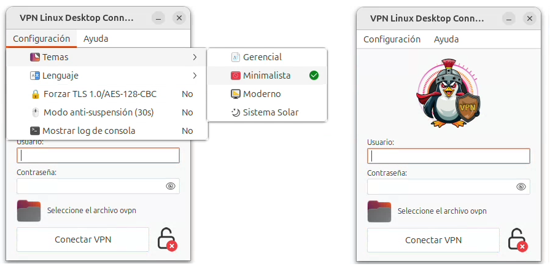
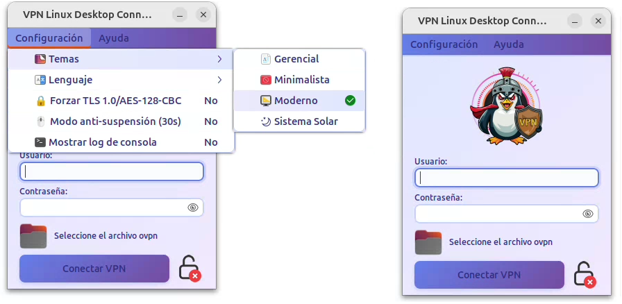
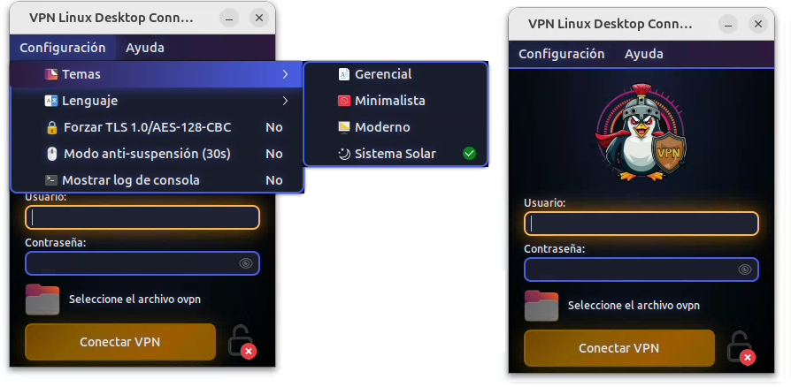
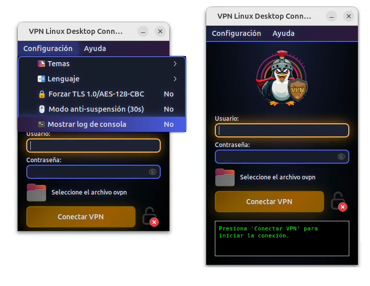
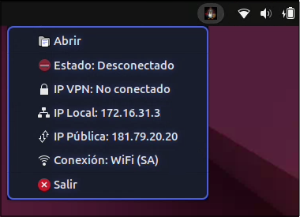

# VPN Linux Desktop Connector

Una aplicación de escritorio moderna para gestionar conexiones VPN en Linux usando OpenVPN con interfaz gráfica GTK3.

## Autores

Urreste García, L. A., Capote Casas, F. E., Castellanos Muriel, J. A., & Rincón Brito, C. D. (2025). VPN Linux Desktop Connector (v1.0.0) [Software]. Zenodo. https://doi.org/10.5281/zenodo.10293847

## Características

### Interfaz y Experiencia de Usuario
- ✅ Interfaz gráfica intuitiva con GTK3
- ✅ Íconos personalizados en ventana y bandeja del sistema
- ✅ Soporte multiidioma (Español 🇨🇴, Inglés 🇬🇧, Chino 🇨🇳, Portugués 🇧🇷, Francés 🇫🇷, Alemán 🇩🇪, Japonés 🇯🇵)
- ✅ 4 temas visuales personalizables:
  - **Gerencial**: Estilo corporativo profesional

    

  - **Minimalista**: Diseño limpio y simple

    

  - **Moderno**: Gradientes vibrantes contemporáneos

    

  - **Sistema Solar**: Tema oscuro inspirado en el espacio

    
- ✅ Atajos de teclado: presiona **Enter** en el campo de contraseña para conectar automáticamente
- ✅ Forzar TLS 1.0: Si tu cliente OpenVPN es de la versión 2.3.6 a la 2.3.2, prueba a añadir tls-version-min 1.0
- ✅ Modo antisuspensión: permite mantener el screen o pantalla activa, realizando un leve movimiento de puntero cada 30 segundos
- ✅ Mostrar Consola: permite ver el log de la ejecución de openvpn

  

### Conexión y Seguridad
- ✅ Gestión inteligente de conexiones:
  - Timeout automático de 90 segundos para evitar conexiones colgadas
  - Detección de intentos de reconexión (máximo 3 intentos)
  - Captura y visualización de mensajes de error de OpenVPN
  - Terminación limpia del proceso con señal SIGINT
- ✅ Almacenamiento seguro de credenciales con encriptación Fernet
- ✅ Archivos de configuración con permisos restrictivos (600)
- ✅ Clave de encriptación única por usuario y máquina
- ✅ Soporte para TLS 1.0 en servidores legacy

### Monitoreo y Logs
- ✅ Logs en tiempo real de conexión OpenVPN
- ✅ Indicador visual de estado con semáforo (verde/amarillo/rojo)
- ✅ Información de red actualizada automáticamente en la barra de tareas:
  - Estado de conexión VPN
  - IP del túnel VPN (tun0)
  - IP local de la máquina
  - IP pública (con módulo requests)
  - Tipo de conexión (WiFi con nombre de red / Ethernet)

  

## Instalación Rápida

```bash
sh install.sh
```

## Instalación Manual

Si prefieres instalar manualmente, copia y pega el siguiente código:

```bash
cd ~ && curl -L https://github.com/danielrincon302/VPN-Linux-Desktop-Connector/archive/refs/heads/main.zip -o vpn-temp.zip &&
unzip -o -q vpn-temp.zip && rm -rf VPN-Desktop-Linux-Conector 2>/dev/null &&
mv VPN-Linux-Desktop-Connector-main VPN-Desktop-Linux-Conector &&
rm vpn-temp.zip && cp ~/VPN-Desktop-Linux-Conector/Run-VPN-Desktop-Linux-Conector.desktop "$(xdg-user-dir DESKTOP)"/ &&
chmod +x "$(xdg-user-dir DESKTOP)/Run-VPN-Desktop-Linux-Conector.desktop"  &&
sed -i "s|\$HOME|$HOME|g" "$(xdg-user-dir DESKTOP)/Run-VPN-Desktop-Linux-Conector.desktop"  &&
chmod +x "$(xdg-user-dir DESKTOP)/Run-VPN-Desktop-Linux-Conector.desktop" &&
gio set "$(xdg-user-dir DESKTOP)/Run-VPN-Desktop-Linux-Conector.desktop" metadata::trusted true
echo "✓ Installation complete. Check your desktop icon"
```

**Nota**: Esta aplicación **NO requiere permisos de root** para ejecutarse (solo para la instalación de dependencias). El ícono de bandeja usa `Gtk.StatusIcon` que viene incluido con GTK3.

## Uso

### Iniciar la aplicación

**Opción 1**: Haz doble clic en el ícono `.desktop` que se instaló en tu escritorio

**Opción 2**: Ejecuta directamente desde la línea de comandos:

```bash
python3 VPN-Desktop-Linux-Conector.py
```

### Configuración Inicial

1. Selecciona tu archivo OVPN (proporcionado por tu administrador de red)
2. Ingresa tu usuario y contraseña
3. Las credenciales se guardarán automáticamente de forma segura y encriptada
4. Haz clic en "Conectar VPN" o presiona **Enter** en el campo de contraseña

### Conectar a la VPN

**Opción 1**: Haz clic en el botón "Conectar VPN"

**Opción 2**: Presiona la tecla **Enter** mientras el cursor está en el campo de contraseña

**Comportamiento de la conexión**:
- La aplicación intentará conectar durante un máximo de 90 segundos
- Si detecta problemas de reconexión (más de 3 intentos), detendrá automáticamente el proceso
- Los mensajes de error de OpenVPN se mostrarán en los logs en tiempo real
- Si la conexión es exitosa, la ventana se minimizará a la bandeja del sistema

### Cambiar Idioma

1. Ve a Menú → Configuración → Lenguaje
2. Selecciona el idioma deseado
3. La interfaz se actualizará automáticamente sin reiniciar

### Cambiar Tema

1. Ve a Menú → Configuración → Temas
2. Selecciona entre los 4 temas disponibles:
   - **Gerencial**: Estilo corporativo profesional
   - **Minimalista**: Diseño limpio y minimalista
   - **Moderno**: Gradientes vibrantes modernos
   - **Sistema Solar**: Tema oscuro inspirado en el espacio
3. El tema se aplica instantáneamente

## Indicador de Bandeja del Sistema

La aplicación incluye un ícono de bandeja del sistema que aparece automáticamente en la barra de tareas:

### Funcionalidades
- **Minimizar a bandeja**: Al cerrar la ventana, la aplicación permanece en segundo plano
- **Clic izquierdo**: Alterna mostrar/ocultar la ventana principal
- **Clic derecho**: Menú contextual con información en tiempo real:
  - Estado de conexión (Conectado ✓ / Desconectado)
  - IP del túnel VPN
  - IP local
  - IP pública
  - Tipo de conexión (WiFi con nombre / Ethernet)
  - Abrir/Restaurar ventana
  - Salir de la aplicación

### Características Técnicas
- ✅ Usa `Gtk.StatusIcon` incluido en GTK3 (sin dependencias adicionales)
- ✅ Funciona sin permisos de root
- ✅ Compatible con todos los entornos de escritorio GTK3
- ✅ Actualización automática cada 5 segundos
- ✅ Ícono dinámico que cambia según el estado de conexión

## Estructura del Proyecto

```
VPN-Desktop-Linux-Connector/
├── VPN-Desktop-Linux-Conector.py    # Aplicación principal
├── README.md                        # Este archivo
├── icons/                           # Íconos de la aplicación
│   ├── VPN-LDC_16x16.svg           # Ícono 16x16 (reservado)
│   ├── VPN-LDC_22x22.svg           # Ícono 22x22 (reservado)
│   ├── VPN-LDC_24x24.svg           # ⭐ Bandeja del sistema
│   └── VPN-LDC_32x32.svg           # ⭐ Ventana principal y About
├── config.txt                       # Credenciales (generado automáticamente)
├── idioma.txt                       # Idioma seleccionado
├── tema.txt                         # Tema seleccionado
└── .vpn_key                         # Clave de encriptación (oculto)
```

## Íconos Personalizados

La aplicación usa íconos personalizados en formato SVG:

- **Ventana principal**: Muestra el ícono `VPN-LDC_32x32.svg` en la barra de título
- **Bandeja del sistema**: Usa `VPN-LDC_24x24.svg` para el ícono de la bandeja
- **Diálogo About**: Logo escalado a 128x128 píxeles
- **Título**: "VPN Linux Desktop Connector" visible en la barra de título

Ver `icons/README_ICONS.md` para más detalles sobre la implementación.

## Seguridad

### Protección de Credenciales
- ✅ Contraseñas encriptadas con **Fernet** (criptografía simétrica de alto nivel)
- ✅ Clave de encriptación única generada por usuario y máquina
- ✅ Archivos de configuración con permisos restrictivos Unix (600)
- ✅ Archivo de credenciales temporales se elimina después de cada uso
- ✅ No se almacenan contraseñas en texto plano en ningún momento

### Gestión de Procesos
- ✅ Terminación limpia del proceso OpenVPN con señal SIGINT
- ✅ Timeout automático para evitar procesos zombis
- ✅ Detección de estados colgados o en bucle de reconexión
- ✅ Limpieza automática de archivos temporales al finalizar

## Solución de Problemas

### Timeout de conexión (90 segundos)

**Síntoma**: La conexión se detiene automáticamente después de 90 segundos mostrando "TIMEOUT".

**Causas posibles**:
- Servidor VPN no responde o está caído
- Configuración OVPN incorrecta
- Problemas de red o firewall bloqueando la conexión
- Necesidad de configurar TLS 1.0 para servidores legacy

**Solución**:
1. Verifica que el servidor VPN esté activo
2. Revisa los logs para identificar el error específico
3. Si aparece error de TLS, acepta activar TLS 1.0 cuando se solicite
4. Verifica tu conexión a internet

### Demasiados intentos de reconexión

**Síntoma**: La aplicación detiene la conexión después de 3 intentos de reconexión.

**Causa**: El servidor VPN está rechazando la conexión repetidamente.

**Solución**:
1. Revisa las credenciales (usuario y contraseña)
2. Verifica el archivo OVPN
3. Consulta con tu administrador de red si el servidor está operativo
4. Revisa los logs para ver el mensaje de error específico

### El ícono de bandeja no aparece

**Causas posibles**:
- El entorno de escritorio no soporta bandejas del sistema
- Extensiones del sistema que bloquean íconos de bandeja

**Solución**: La ventana principal funciona normalmente sin el ícono de bandeja.

### Error de autenticación

**Verifica**:
- Usuario y contraseña correctos
- Archivo OVPN válido y actualizado
- Conexión a internet activa
- Credenciales no expiradas

### No se puede conectar

**Asegúrate de tener permisos sudo para OpenVPN**:
```bash
sudo openvpn --version
```

Si el comando anterior falla, instala OpenVPN:
```bash
sudo apt-get install openvpn
```

### La IP pública no se muestra

**Instala el módulo requests**:
```bash
pip3 install requests
```

La aplicación funciona sin este módulo, pero no mostrará la IP pública.

## Licencia

GPL 3.0

## Contribuciones

Las contribuciones son bienvenidas. Por favor:
1. Haz fork del repositorio
2. Crea una rama para tu feature (`git checkout -b feature/NuevaCaracteristica`)
3. Commit tus cambios (`git commit -m 'Agregar nueva característica'`)
4. Push a la rama (`git push origin feature/NuevaCaracteristica`)
5. Abre un Pull Request

## Soporte

### Reportar Problemas

Para reportar bugs o solicitar nuevas características, abre un issue en GitHub incluyendo:

**Información del sistema**:
- Distribución de Linux y versión (ej: Ubuntu 22.04)
- Versión de Python (`python3 --version`)
- Versión de OpenVPN (`openvpn --version`)
- Entorno de escritorio (GNOME, KDE, XFCE, etc.)

**Logs de la aplicación**:
- Copia el contenido completo del área de logs
- Incluye el mensaje de error específico
- Indica los pasos para reproducir el problema

**Capturas de pantalla** (opcional):
- Ayudan a entender mejor el problema visual

---

**Desarrollado con ❤️ para la comunidad Linux**
